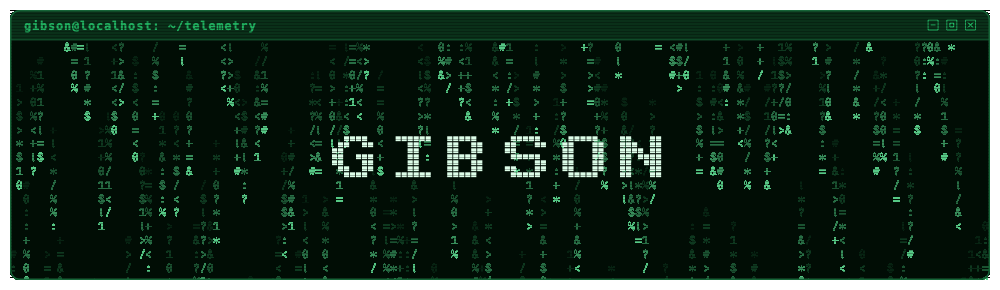
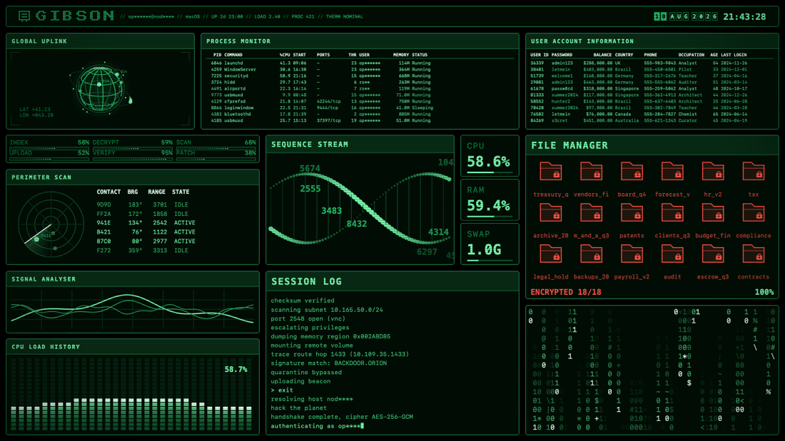
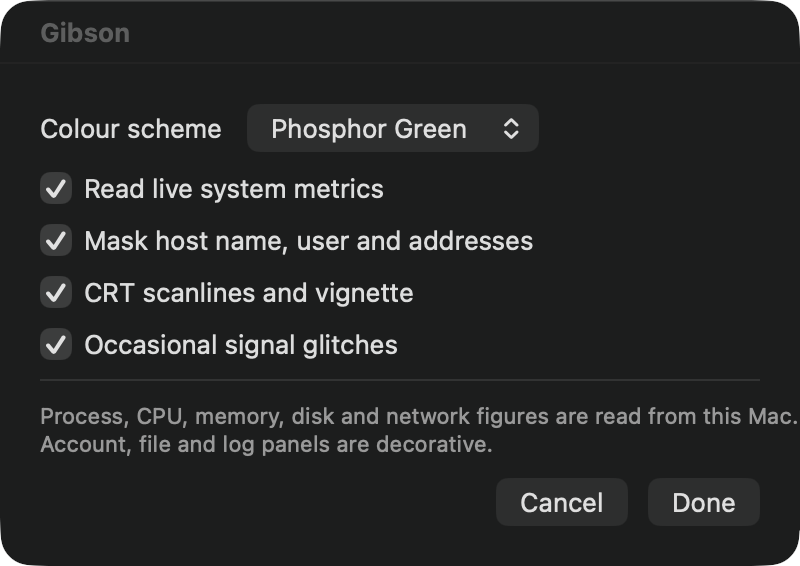
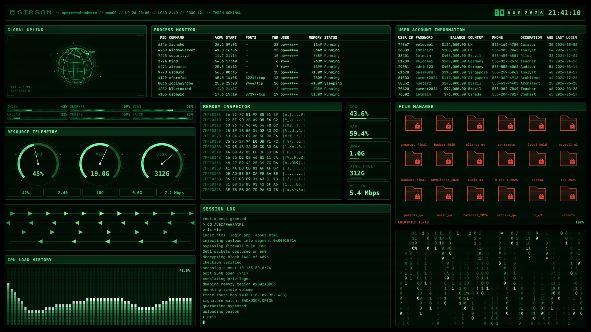
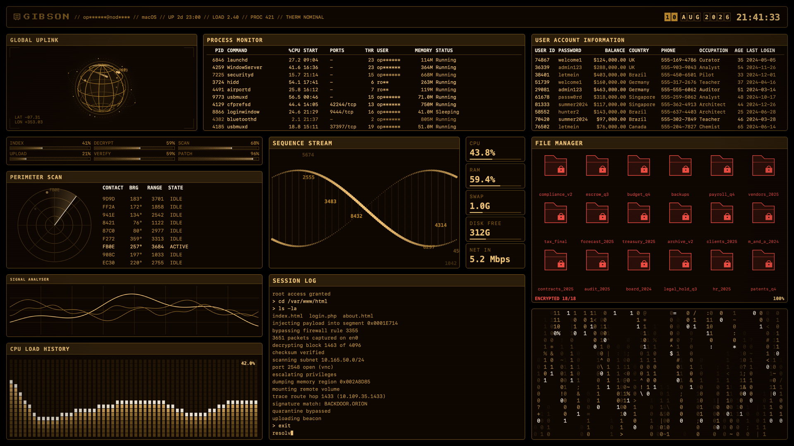
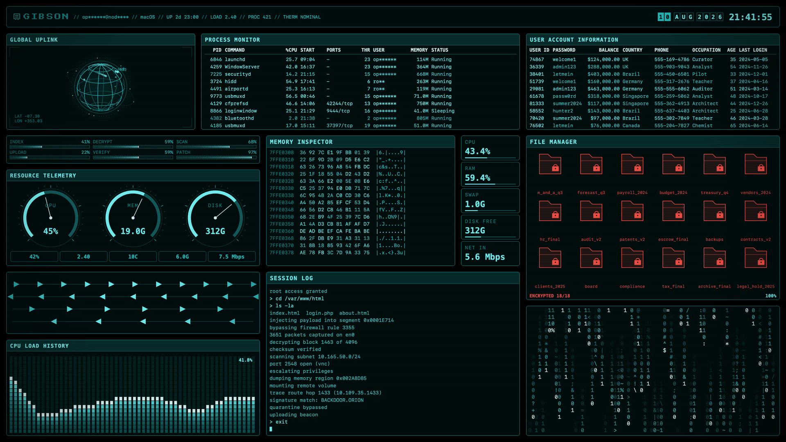
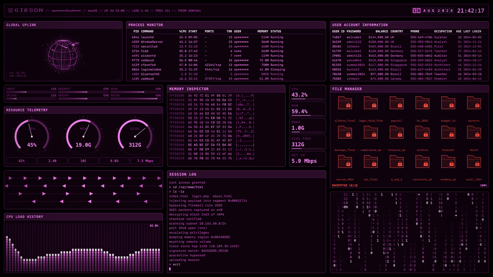
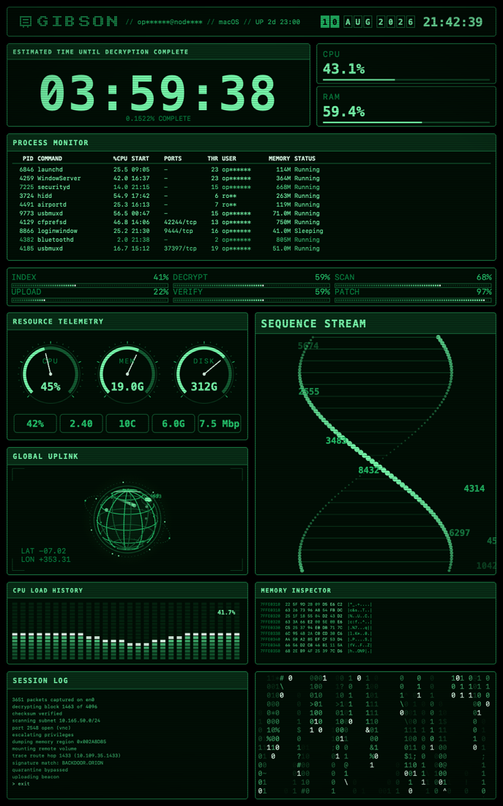
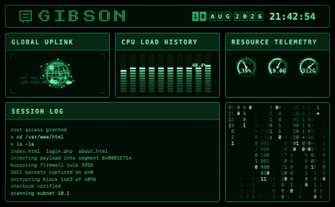
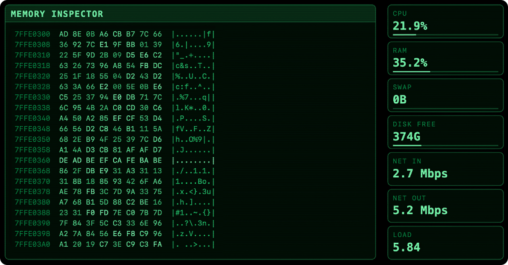

<div align="center">



# Gibson

**A macOS screen saver that turns your display into the security operations dashboard from every hacker film ever made.**

Except half of it is real. The process table, CPU load, memory pressure, disk usage and network throughput are read from the machine it runs on.

[](https://github.com/PerfectoWeb/Gibson/actions/workflows/ci.yml)
[](https://github.com/PerfectoWeb/Gibson/releases/latest)
[](#requirements)
[](#requirements)
[](https://swift.org)
[](LICENSE)
[](#building-from-source)
[](https://github.com/PerfectoWeb/homebrew-tap)

<br>

<a href="https://github.com/PerfectoWeb/Gibson/releases/latest/download/Gibson.saver.zip">
  <picture>
    <source media="(prefers-color-scheme: dark)" srcset="docs/images/download-dark.webp">
    
  </picture>
</a>

**No terminal, no account, nothing to sign up for.** Unzip, double click, then
pick Gibson in System Settings.
[Every step, with screenshots](docs/INSTALL.md).

Package manager instead? `brew install --cask perfectoweb/tap/gibson`

</div>



## Contents

- [What you get](#what-you-get)
- [Requirements](#requirements)
- [Install](#install): [Homebrew](#with-homebrew), [release](#from-a-release), [source](#from-source), [illustrated walkthrough](docs/INSTALL.md)
- [Options](#options)
- [Colour schemes](#colour-schemes)
- [What is real and what is not](#what-is-real-and-what-is-not)
- [Building from source](#building-from-source)
- [How it fits together](#how-it-fits-together)
- [Support and contributions](#-support--contributions)
- [License](#-license)

## What you get

Seventeen panels laid out on a grid that stretches to any display: a wireframe
globe, a sweeping radar, a live process table, dial clusters, a hex dump, an
oscilloscope, a scrolling session log, a file vault that seals itself one folder
at a time, and a wall of falling digits.

| | |
| --- | --- |
| **Real telemetry** | Process table, CPU per core, memory, swap, disk, network, load average, uptime, thermal state |
| **Four colour schemes** | Phosphor green, amber CRT, ice cyan, neon magenta |
| **Three layouts** | Landscape, portrait, and a compact one for the System Settings preview |
| **Universal binary** | Apple silicon and Intel, macOS 14 and newer |
| **No dependencies** | Nothing but the system frameworks. No package manager, no Xcode project |

## Requirements

- macOS 14 Sonoma or newer. Tested on Sonoma, Sequoia and Tahoe.
- Apple silicon or Intel. The bundle is universal.

## Install

### With Homebrew

```bash
brew install --cask perfectoweb/tap/gibson
```

That taps, downloads the notarised bundle and drops it into
`~/Library/Screen Savers`. Then open System Settings, go to Wallpaper, click
**Screen Saver…**, set **Use Screen Saver** to **Custom** and pick Gibson.

New versions arrive with `brew upgrade --cask`. To remove it and its
preferences, `brew uninstall --zap --cask gibson`.

### From a release

1. [Download `Gibson.saver.zip`](https://github.com/PerfectoWeb/Gibson/releases/latest/download/Gibson.saver.zip)
   and unzip it.
2. Double click the bundle and choose whether to install it for yourself or for
   everyone on the machine.
3. Open System Settings, go to Wallpaper, click **Screen Saver…**, set **Use
   Screen Saver** to **Custom** and pick Gibson at the bottom of the grid.

Releases are signed with a Developer ID and notarised by Apple, so there is no
quarantine flag to clear and no security warning to dismiss.
**[docs/INSTALL.md](docs/INSTALL.md) shows every dialog with screenshots.**

### From source

```bash
git clone https://github.com/PerfectoWeb/Gibson.git
cd Gibson
make install
```

That builds a universal bundle, signs it ad hoc and copies it into
`~/Library/Screen Savers`. `make uninstall` removes it again.

> **If the picker still shows an old build or an old tile:** macOS caches both,
> and the cache does not notice that the bundle changed. See
> [docs/TROUBLESHOOTING.md](docs/TROUBLESHOOTING.md).

## Options

Click **Options…** next to Gibson in the screen saver picker.



| Option | Default | What it does |
| --- | --- | --- |
| Colour scheme | Phosphor Green | Every panel derives its tints from one hue. |
| Read live system metrics | On | Off replaces every reading with a synthesised one and stops sampling the host entirely. |
| Mask host name, user and addresses | On | Shows `da**@Mac***` instead of the real names, which matters on a lock screen. |
| CRT scanlines and vignette | On | The overlay treatment. |
| Occasional signal glitches | On | A tear band across the screen every few seconds. |

## Colour schemes

| Phosphor Green | Amber CRT |
| :--- | :--- |
|  |  |
| **Ice Cyan** | **Neon Magenta** |
|  |  |

Portrait displays get their own layout, with the countdown promoted to the top:



The System Settings preview gets a compact layout of its own, since dense text
is unreadable at that size:



## What is real and what is not

This matters if you leave the screen saver running in an office.

**Read from your Mac**

- Process table: PID, executable name, CPU share, resident memory, thread count
  and start time, for processes owned by your user account
- CPU utilisation per core and in total, load average
- Memory: used, wired, compressed, swap
- Volume capacity and free space
- Network throughput and the primary interface address
- Host name, user name, macOS version, uptime, thermal state

**Invented for the look**

- The user account table, including every name, password and balance in it
- The file manager grid and its encryption progress
- The session log, the radar contacts and the globe markers
- The `PORTS` and `STATUS` columns of the process table
- The strings planted in the memory inspector, and the code that surfaces over
  the digit rain every few minutes

Nothing leaves the machine, and nothing is written except the screen saver's own
preferences. With **Mask host name, user and addresses** on, those are partly
replaced with asterisks.

Since macOS 14 screen savers run inside a sandboxed host process. If the sandbox
denies a reading, the affected panel falls back to a synthesised value instead of
going blank.

The memory inspector plants readable strings among the bytes now and then:



## Building from source

Xcode or the Command Line Tools are enough. There is no project file to open.

```bash
make             # build build/Gibson.saver, universal
make install     # build, then copy into ~/Library/Screen Savers
make uninstall   # remove it again
make demo        # run the panels in a plain window, no install needed
make screenshot  # render a still offscreen into docs/screenshot.png
make cover       # regenerate the picker tile in Resources/
make banner      # re-render the animated header in docs/images/
make motion      # record the dashboard demo in docs/images/
make lint        # swiftformat, if you have it
```

`make demo` is the fastest loop: it compiles the same sources into an ordinary
app and opens a resizable window, so you can watch a panel react to a resize
without touching System Settings.

Two environment variables help while working on a panel:

| Variable | Effect |
| --- | --- |
| `GIBSON_VARIANT=0` or `1` | Pins the layout variant instead of picking one at random |
| `GIBSON_PALETTE=amber` | Renders a snapshot in a specific colour scheme |

`Package.swift` exists only so SourceKit-LSP can index the sources in Xcode,
VS Code or Zed. The shipping bundle is produced by the Makefile.

## How it fits together

```
Sources/Gibson/
  GibsonView.swift       ScreenSaverView subclass, owns the layer tree
  OverlayLayers.swift    scanlines, vignette, boot sequence
  ConfigureSheet.swift   options sheet, built in code
  Core/                  theme, canvas, fonts, meters, pixel font, grid layout
  Metrics/               sysctl and mach sampling, published as snapshots
  Panels/                one file per group of panels
Sources/Demo/            window host for development
Sources/Snapshot/        offscreen renderer for the stills in this README
Sources/Cover/           renderer for the picker tile
Sources/Banner/          renderer for the animated header
Sources/Motion/          records the running dashboard to an animated GIF
```

A panel is a small object that draws into a top-left origin `Canvas` and says
how often it wants to be redrawn. Tables ask for 1 Hz, the globe and the radar
for 30. Each one is throttled independently, so a slow panel never holds back a
fast one.

[docs/ARCHITECTURE.md](docs/ARCHITECTURE.md) walks through the render loop, the
metrics pipeline and the layout grid. [CONTRIBUTING.md](CONTRIBUTING.md) has a
worked example of adding a panel.

## 💬 Support & Contributions

New panels, layout variants and colour schemes are the most useful
contributions, and bug reports are just as welcome. Start with
[CONTRIBUTING.md](CONTRIBUTING.md), and open an issue before a large change so
nobody duplicates work.

- 💬 Found a bug or have a feature request? [Open an Issue](https://github.com/PerfectoWeb/Gibson/issues)
- ⭐ Like the project? [Star the repo](https://github.com/PerfectoWeb/Gibson)! [Give a coffee](https://perfecto-web.com/d/)!
- 🛠 Want to contribute? [Fork it](https://github.com/PerfectoWeb/Gibson/fork) and submit a pull request.

## 📝 License

MIT, see [LICENSE](LICENSE).
Made with ♥ by [PerfectoWeb](https://github.com/PerfectoWeb).

Named after the supercomputer in *Hackers* (1995).
