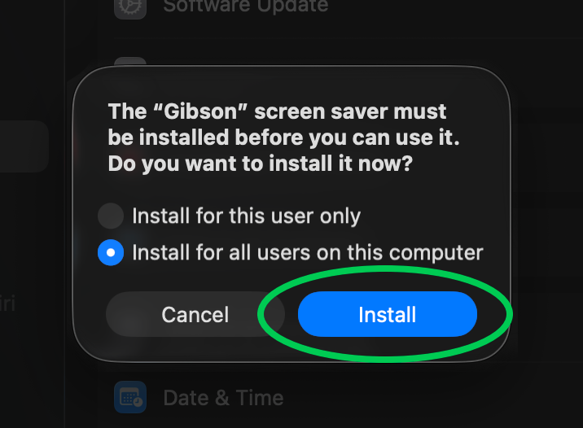
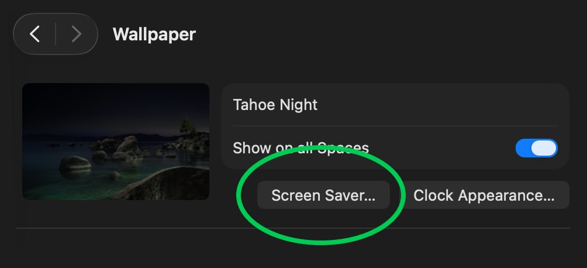
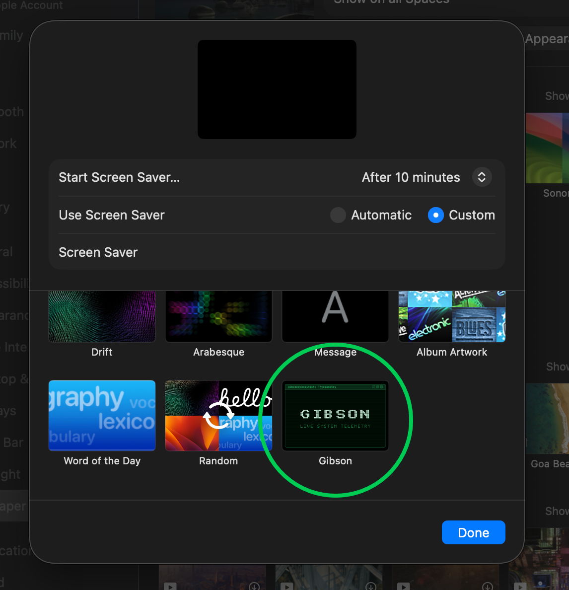
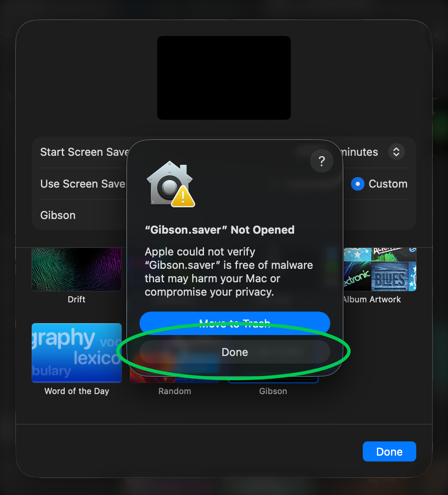
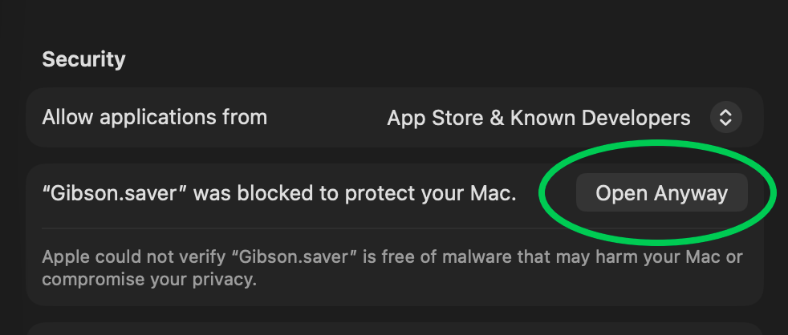

# Installing Gibson

Every dialog you will see, in the order macOS shows them. Two minutes, no
terminal.

Release builds are signed with a Developer ID and notarised by Apple, so macOS
opens them without any warnings. If you built the saver yourself, skip to
[the last section](#if-macos-asks-you-to-verify-it).

## 1. Download

[Download `Gibson.saver.zip`](https://github.com/PerfectoWeb/Gibson/releases/latest/download/Gibson.saver.zip)
and unzip it. Double click `Gibson.saver`.

## 2. Choose who gets it



**Install for this user only** puts the bundle in `~/Library/Screen Savers` and
needs no password. **Install for all users** puts it in `/Library/Screen Savers`
and asks for an administrator password. Either works.

Click **Install**.

## 3. Pick it in System Settings

System Settings opens on the Wallpaper pane. Click **Screen Saver…**.



Set **Use Screen Saver** to **Custom** and scroll to the bottom of the grid.
Gibson sits with the other installed savers. Click it, then **Done**.



That is the whole installation. **Options…** next to the preview holds the
colour scheme and the privacy switches.

## If macOS asks you to verify it

A saver you built from source is signed ad hoc, not with a Developer ID, and so
was the 1.0.0 release. macOS asks you to confirm those once.



**Click Done, not Move to Trash.** The button is quiet next to the blue one, and
it is the one you want. Nothing is deleted, and the choice you need appears in
Settings a moment later.

Go to **Privacy & Security** and scroll to **Security**. There is now a line
about Gibson with an **Open Anyway** button.



Click it, confirm with your password or Touch ID, then go back to Wallpaper >
Screen Saver… and pick Gibson again. macOS remembers the decision.

Clearing the quarantine flag before installing avoids both dialogs:

```bash
xattr -dr com.apple.quarantine ~/Downloads/Gibson.saver
```

## Uninstalling

Delete whichever copy you installed:

```bash
rm -rf ~/Library/Screen\ Savers/Gibson.saver
```

```bash
sudo rm -rf /Library/Screen\ Savers/Gibson.saver
```

Built from source instead? `make uninstall` does the same thing.

## Something went wrong

The picker showing a stale build, an old preview tile, or nothing at all is
almost always a macOS cache rather than a broken bundle.
[docs/TROUBLESHOOTING.md](TROUBLESHOOTING.md) covers those, along with the
preferences that live in a sandboxed container and the reason
`ScreenSaverEngine` refuses to load a locally built saver.
